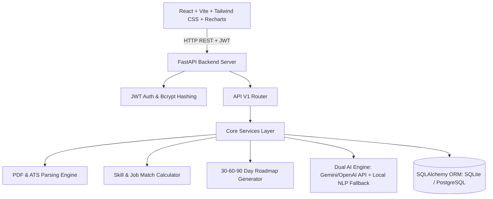
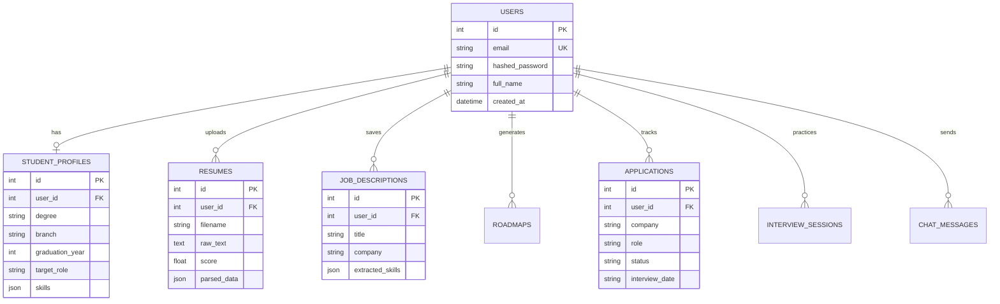

# CareerPilot – AI Job & Placement Assistant

[](#tech-stack)
[](#automated-tests)
[](#docker-deployment)

**CareerPilot** is a production-ready, full-stack AI web platform built specifically for college students and fresh graduates. It empowers job seekers by analyzing PDF resumes, extracting skill inventories, evaluating ATS formatting compliance, calculating explainable resume–job match scores, identifying skill gaps, generating personalized 30/60/90-day learning roadmaps, tracking job application pipelines, simulating AI mock interviews, and providing tailored portfolio project recommendations.

---

## 🌟 Key Features & 13 Core Modules

1. **Authentication:** Secure JWT bearer token authentication with bcrypt password hashing, user session state, and protected route guards.
2. **Student Profile:** Manage academic degree, branch, graduation year, target role, technical skills inventory, and location preferences.
3. **AI Resume Analyzer:** Upload PDF resumes for instant text extraction, ATS format scoring (out of 100), action verb density analysis, and actionable improvement suggestions.
4. **Job Description Analyzer:** Paste target job postings to extract required technical skills, key responsibilities, qualifications, and ATS keywords.
5. **AI Resume–Job Matcher:** Compare your resume with target job postings, generating an explainable match percentage, matching vs missing skills matrix, and ATS gap recommendations.
6. **Skill Gap Analyzer:** Evaluate current skills against target role requirements, categorizing competencies into Mastered, In Progress, and Missing.
7. **AI Learning Roadmap:** Generate personalized 30-day, 60-day, and 90-day learning plans with week-by-week actionable tasks and clickable progress tracking.
8. **Job Application Tracker:** Track job applications with company, role, status (Wishlist, Applied, Assessment, Interview, Offer, Rejected), job URL, interview dates, and notes.
9. **AI Interview Preparation:** Browse HR, Technical, and Behavioral question banks with difficulty tags and STAR method model answers.
10. **AI Mock Interview Studio:** Practice live Q&A sessions with instant AI evaluation of technical accuracy, clarity, and relevance, generating detailed report cards.
11. **AI Career Chatbot:** Contextually aware AI assistant leveraging your profile, resume, skill gaps, and active roadmap.
12. **Analytics Dashboard:** Recharts visualization of ATS resume score gauge, job application pipeline pie/bar charts, skill competency radar, and recent activities.
13. **Project Recommendations:** Recommended portfolio projects tailored to your target role and identified skill gaps with step-by-step implementation guides.

---

## 🏗️ System Architecture



---

## 🗄️ Database Schema Diagram



---

## 🛠️ Tech Stack

- **Frontend:** React 18, Vite, Tailwind CSS, Lucide Icons, Recharts, Axios, React Router DOM v6
- **Backend:** Python 3.11+, FastAPI, Uvicorn, Pydantic v2, PyPDF, Bcrypt, PyJWT
- **Database:** SQLite (default for instant zero-config local dev) / PostgreSQL (production & Docker)
- **AI Architecture:** Dual AI Engine (Google Gemini / OpenAI API integration + local NLP Rule Fallback Engine)
- **Testing:** Pytest (Unit & Integration tests)
- **Containerization & Cloud:** Docker, Docker Compose, Render, Vercel

---

## 🚀 Quick Local Setup Guide

### 1. Backend Setup
```bash
cd backend
python -m venv venv
# On Windows:
venv\Scripts\activate
# On Linux/macOS:
source venv/bin/activate

pip install -r requirements.txt
python -m uvicorn app.main:app --reload --port 8000
```
Backend Swagger REST API documentation will be available at: `http://localhost:8000/docs`

### 2. Frontend Setup
```bash
cd frontend
npm install
npm run dev
```
Frontend Web Application will be available at: `http://localhost:5173`

---

## 🐳 Docker & Docker Compose Setup

Run the entire full-stack application (PostgreSQL + FastAPI + React) in containers:

```bash
docker-compose up --build
```
- Web Application: `http://localhost`
- FastAPI REST Docs: `http://localhost:8000/docs`

---

## 🧪 Automated Testing

To run the backend test suite:
```bash
cd backend
python -m pytest tests
```

---

## 📄 License
Created for B.Tech Placement Project Demonstration and Portfolio Showcase.
